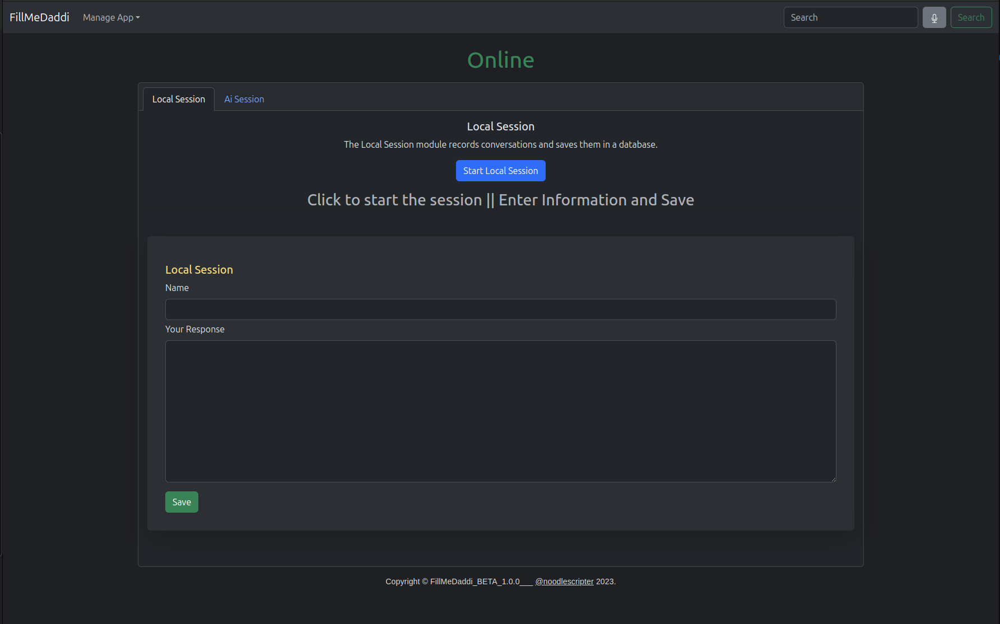
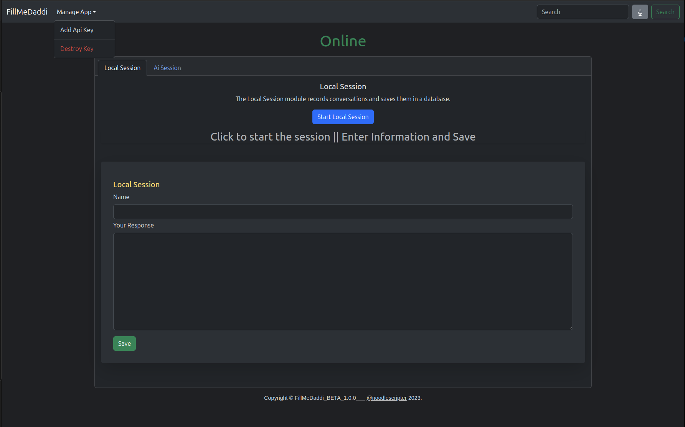
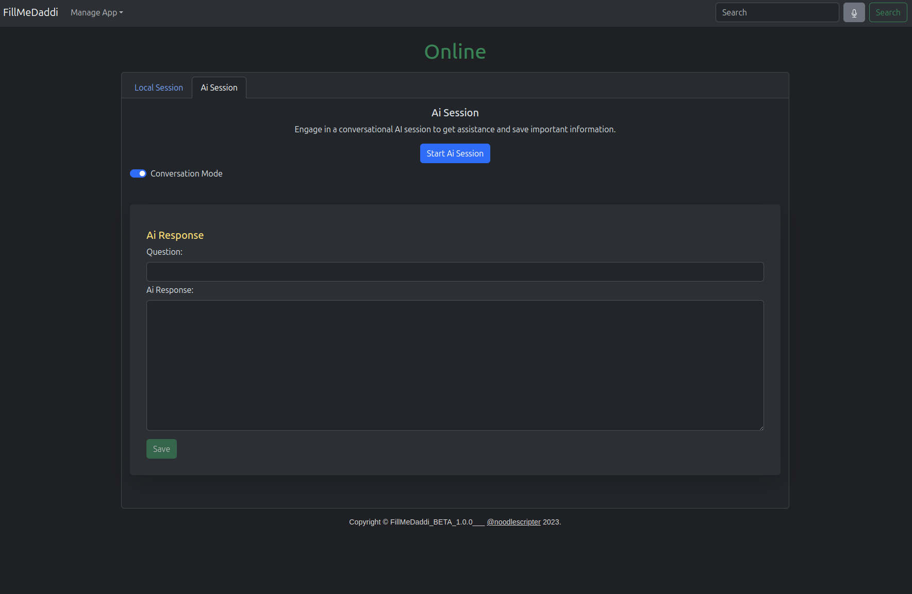
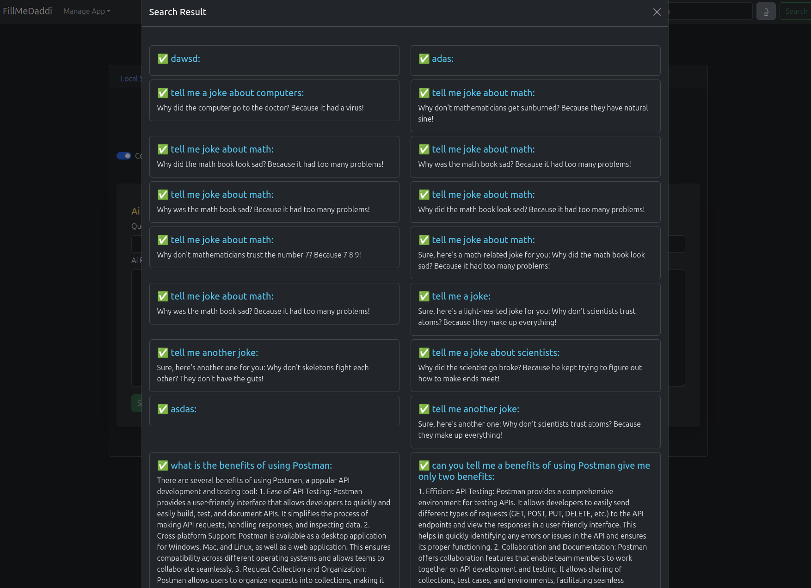

# FillmeDaddi - AI-Powered Conversation and Information Management App

FillmeDaddi is a React-based web application that leverages AI technology to engage in conversations with an AI and maintain records of all the information exchanged. It allows users to chat with the AI, and also offers a voice interface for talking to the AI. Additionally, it features a hands-free search function for accessing information effortlessly.

## Table of Contents
- [Features](#features)
- [Demo](#demo)
- [Installation](#installation)
- [Usage](#usage)
- [Technologies Used](#technologies-used)
- [Contributing](#contributing)
- [License](#license)

## Features

1. **Chat with AI**: Engage in text-based conversations with an AI chatbot.
2. **Voice Interaction**: Communicate with the AI using your voice through speech recognition.
3. **Record Keeping**: Automatically store and organize all conversation data for future reference.
4. **Information Retrieval**: Conduct hands-free searches to access information stored in the app.
5. **User-Friendly Interface**: A clean and intuitive user interface for a seamless experience.
6. **AI-Powered Responses**: Experience intelligent and context-aware responses from the AI.
7. **Customization**: Tailor the AI's behavior and appearance to your preferences.

## Demo




## Installation

Follow these steps to install and run FillmeDaddi locally:

1. Clone the repository to your local machine:

   ```shell
   git clone https://github.com/noodlescripter/FillMeDaddi_Release.git
   ```

2. Navigate to the project directory:

   ```shell
   cd FillmeDaddi_Release/backend
   ```

3. Install the required dependencies:

   ```shell
   docker-compose up -d
   ```

4. Start the development server:

   ```shell
      cd FillmeDaddi_Release/server
   ```
5. Navigate to the project directory:

   ```shell
   docker-compose up -d
   ```
6. Open your web browser and access the application at `https://localhost:3000`.

## Usage

Once the application is running, you can:

- Initiate a conversation with the AI through the chat interface.
- Use the voice recognition feature to talk to the AI.
- Browse and search for stored information using the hands-free search function.
- Customize the AI's behavior and appearance through the settings.

## Technologies Used

- React: A JavaScript library for building user interfaces.
- AI-powered Chatbot: Utilizes AI technology for natural language processing and generating responses.
- Speech Recognition: Integrates with speech recognition APIs to enable voice interactions.
- Database (e.g., Firebase): Stores and manages conversation data.
- Web Speech API: For voice recognition and synthesis.
- HTML/CSS: For creating the user interface and styling.

## Contributing

No contribution is allowed at the moment.

## License

This project is licensed under the MIT License - see the [LICENSE.md](LICENSE.md) file for details.

---

Feel free to reach out to the project maintainers or open issues if you have questions or encounter any problems. We hope FillmeDaddi enhances your conversational and information management experience!